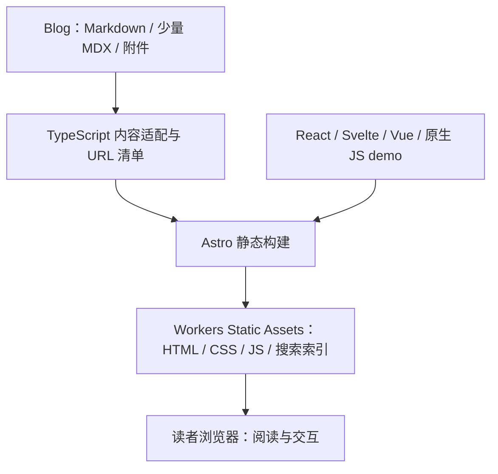

**Blog 前端迁移评估与技术方案**

评估日期：2026-09-07。以下保留迁移前的评估快照，当时只形成方案，没有迁移框架、部署或修改域名。迁移与上线现已完成，当前方案见 [README](../README.md) 和 [构建与发布](../docs/continuous-deployment.md)；下表中的 Hugo 源码链接指向 `hugo-book` 备份分支。

**最终决定：选择 Astro**

采用 **Astro 静态生成 + 自有 Book 布局 + Markdown/MDX + 按需多框架 demo + Cloudflare Workers Static Assets**。React / HeroUI Pro 是当前主要组件资源，未来按研究需要加入 Svelte、Vue、Three.js 或其他前端技术。Blog 继续作为内容与研究 demo 的来源，站点项目负责构建和发布。近期保持纯静态，不建设或维护业务 Worker、API、数据库或独立后端。

用户补充的“多框架研究、高度定制、直接复用 Hugo Book 外观、近期无后端”让选型明确。Astro 作为框架中立的内容与页面编排层，比以 React 为中心的 Fumadocs + React Router 更贴合当前方向。后续 PoC 用来验证 Astro 的实现与迁移质量，不再进行两套整站方案的平行开发。

Astro 官方提供 React、Svelte、Vue 等集成，MDX 可导入 Astro 与 UI 框架组件。每个交互组件按需要加载运行时；同页确实使用多框架时仍会付出多个运行时的成本，不能理解为多框架零开销。[框架集成](https://docs.astro.build/en/guides/framework-components/)、[MDX 集成](https://docs.astro.build/en/guides/integrations-guide/mdx/)

Fumadocs 也可深度定制和静态预渲染，SEO/Cloudflare 并不是淘汰它的原因。核心区别在于：本项目已有满意的外观，希望掌握布局源码，并将持续研究多个框架，Fumadocs 默认 UI 与 React 应用壳的收益相对有限；绕过这些层仍需承担相同的内容兼容工作。

**高定制化与 Hugo Book 复用方式**

移植基准为当前锁定的 Hugo Book 提交 `cec082b8dd9b` 加上本站 layouts/assets 覆盖，而非 GitHub 最新 main。已核实本地精确版本：基础布局是 `.book-menu`、`.book-page`、`.book-toc` 的 HTML，移动导航主要由 checkbox 与 CSS 控制，适合移入自有 `BookLayout.astro`。

- 可直接保留或少量适配：三栏 HTML/class、SCSS、主题颜色、正文排版、SVG 图标、移动菜单控制关系，以及适用的普通 JavaScript。主题 `book.scss` 的 Go 主题选择表达式可按当前 auto 配置改成普通 Sass。
- 必须重写：Go template 的内容循环、目录树、active/ancestor 状态、URL、taxonomy、分页和聚合规则。用 TypeScript 内容索引与 Astro 模板重新生成同样的结构。
- 复制主题时保留 MIT LICENSE 和版权声明；记录来源提交。后续维护项目自己的布局源码，按需求选择性吸收上游变化。[Hugo Book](https://github.com/alex-shpak/hugo-book)
- 布局、文章渲染、内容索引、demo 各自保持明确接口。HeroUI 用于合适的 React 交互区域，站点布局不依赖某套 React UI 库。

这种方案要求自行维护 taxonomy 与聚合页的规则；这是高定制化带来的明确成本。Astro 不会自动复现 Hugo 的 tag/category 行为，迁移时必须将其作为核心功能实现。

**tags、categories 与自定义栏目是核心数据模型**

从同一份公开内容索引生成 tags/categories 的索引页、各 term 页面、文章关联、数量、排序、分页和既有 feed，保留旧 URL、大小写与规范化行为。不能只把 frontmatter 字段读出来就算完成。跨页菜单、标签、分类和正文链接应共用同一套 URL 解析。

timeline、weekly、portfolio、links 保留为独立页面类型：timeline 按年/日期组织；weekly 保留列表、单期页与 RSS；portfolio 读取结构化作品数据；links 保留来源信息及既有跳转行为。页面模板由项目直接维护，以便后续自由改布局、筛选和交互，不需要后端。

**现状与迁移规模**

现有站点是经过定制的 Hugo Book 博客，包含 41 个 layouts 文件，主要自定义样式文件约 1,042 行。线上首页采用左侧导航、中间内容、右侧标签的三栏结构；文章右栏使用 TOC，移动端另有导航行为。迁移应把这些看作需要复刻的产品行为。

| 现有实现 | 迁移时需要保留 |
| --- | --- |
| [配置](https://github.com/tcitry/tcitry.github.io/blob/hugo-book/config.toml) | 自定义域名、路径大小写、posts permalink、内容排除、lastmod 回退 |
| [内容构建入口](https://github.com/tcitry/tcitry.github.io/blob/hugo-book/makefile) | 外部 Blog 内容源，独立于站点源码 |
| [部署工作流](https://github.com/tcitry/tcitry.github.io/blob/hugo-book/.github/workflows/pages.yml) | 固定内容修订、Git 修改时间、内容更新触发、公开产物检查 |
| [正文脚本](https://github.com/tcitry/tcitry.github.io/blob/hugo-book/layouts/partials/docs/inject/body.html) | Pagefind 搜索、快捷键、KaTeX、目录高亮、外链行为 |
| [评论注入](https://github.com/tcitry/tcitry.github.io/blob/hugo-book/layouts/partials/docs/inject/footer.html) | Giscus pathname 匹配、评论顺序、仅文章页启用 |
| [Mermaid 渲染](https://github.com/tcitry/tcitry.github.io/blob/hugo-book/layouts/_markup/render-codeblock-mermaid.html) | 按需加载、防止重复初始化、宽图局部滚动 |
| [版面变量](https://github.com/tcitry/tcitry.github.io/blob/hugo-book/assets/_variables.scss) | 三栏宽度、列表页差异、移动端断点 |

真实内容来自独立 Blog 检出目录（构建时通过 `BLOG_DIR` 指定）；当时站点仓库中的 `en/` 只是少量示例，不能代表迁移规模；这些未使用的 Hugo 示例现已从 `main` 移除。

| Blog 公开候选内容统计 | 数量 |
| --- | ---: |
| Markdown 文件 | 1,077 |
| 其中 `_index.md` | 118 |
| docs / posts / weekly | 761 / 157 / 60 |
| links / timeline / 根目录页面 | 89 / 2 / 8 |
| Hugo `relref` | 439 处，分布于 116 个文件 |
| Mermaid 图 | 103 个围栏，分布于 65 个文件 |
| 代码块 | 约 6,415 个，59 种语言标识 |
| 原始 HTML / iframe 所在文件 | 约 49 / 8 |
| 显式 slug / url | 346 / 15 |

统计使用 Git 跟踪与未忽略的现存文件，过滤私有、草稿、模板、工具与本地 demo 等目录，以及 `draft:true`、`build.render:never`。这是工作区的公开候选数量，不等于线上页面总数；代码和 HTML 数量来自轻量扫描，仍需新编译器验证。尝试直接构建整个本地 Blog 时，本地 demo 的依赖目录也被 Hugo 扫描并产生大量路径告警，已停止。因此本次没有取得可作为迁移验收基准的完整 Hugo 构建结果；正式实施应从固定内容修订和受控输入生成基准。

**候选方案的取舍**

Vite 是构建基础，Astro 是站点框架，Fumadocs 是可组合的文档工具及 UI 层，它们不是完全同一层的替代品。

| 方案 | 对当前目标的判断 | 主要代价 |
| --- | --- | --- |
| Astro + 自有 Book 布局 + 多框架 demo | 已选定 | 一次性迁移模板和内容规则；自行维护页面与 taxonomy |
| Fumadocs + React Router / Vite + 全路径预渲染 | 本次不选 | 仍需迁移旧布局与内容规则，非 React demo 还需额外安排集成边界 |
| Fumadocs + Next.js | 后续主站发展为较完整应用时再考虑 | 对当前静态内容站增加 App Router、服务端/客户端边界和部署适配成本 |
| Astro + Starlight | 接受其默认文档外观时合适 | 当前博客有周刊、时间线、作品集等自定义结构，仍需较多主题覆盖 |
| 裸 Vite + React | 继续适合独立实验；不推荐直接作为整站方案 | 需要自己补内容模型、路由输出、元数据、RSS、搜索等 SSG 能力 |

Fumadocs 当前支持 React Router、Astro 等集成，并非只能配 Next.js。静态部署必须枚举需要生成的页面并配置静态搜索；只关闭 SSR 不代表每篇文章已生成完整 HTML。[Fumadocs 静态部署](https://www.fumadocs.dev/docs/deploying/static)、[React Router 集成](https://www.fumadocs.dev/docs/manual-installation/react-router)、[Astro 集成](https://www.fumadocs.dev/docs/manual-installation/astro)

Starlight 可以覆盖布局，但替换组件仍使用 Astro；Vite 官方将其 SSR 接口定位为偏底层的能力。上表的成本排序是结合本站定制程度作出的工程判断。[Starlight 组件覆盖](https://starlight.astro.build/guides/overriding-components/)、[Vite SSR](https://vite.dev/guide/ssr)

首版采用一套自定义站点布局，不同时引入 Starlight、Fumadocs UI 和 HeroUI Pro 三套视觉体系。将来某项 Fumadocs Core 能力确实能减少维护时，可单独评估。

**推荐架构与职责**



建议先保持一个简单的站点工程，不为迁移额外建设复杂 monorepo。概念性目录如下，实施时再创建：

```text
Blog/
  docs/ posts/ weekly/ ...  # 继续写 Markdown，交互文章用 MDX
  frontend-demos/           # 建议新增：可随文章保存的 demo 源码及资源
site/
  src/content-adapter/      # frontmatter、relref、路径、导航、日期兼容
  src/layouts/              # 少量 Astro 页面编排，复刻现有三栏
  src/components/ui/        # 通用 React / HeroUI 等组件
  src/demos/                # 站点级 demo；也可导入 Blog 内的 demo
  src/pages/                # 文章、聚合页和 demo 的静态路由
  scripts/                  # 内容导入、路由检查、索引和 feeds
  public/                   # 明确允许发布的静态资源
```

日常写作仍发生在 Blog：提交文章触发站点构建，生成静态页面后发布。正式构建不依赖在线模型返回结果。Blog 的 Markdown 不应因更换托管平台而改成 CMS 数据或迁入数据库。

**内容与 URL 兼容层**

最重要的迁移产物是一份受控的旧站清单：`sourcePath → finalPath / canonical / aliases / headingIds / giscusTerm`，同时记录 page kind 和导航关系。它应来自固定修订的 Hugo 构建与源文件信息，并对照线上关键页面，不能只靠 Astro 默认 slug 推导。

1. **保留 URL 的优先级。** 先尊重显式 `url`，再处理 section permalink、slug 和原目录规则。发现 15 个存于 docs 目录、实际发布在 `/posts/.../` 的文件；不能按目录搬迁它们的地址。大小写、中文编码、末尾斜杠与已有 aliases 均需保留。页面标题 ID 也要验证，避免旧 `#anchor` 链接失效。
2. **处理实际冲突。** `docs/Python/语言基础.md` 与 `docs/Python/语言基础/_index.md` 存在默认路径竞争；实施前确认 Hugo 当前实际输出及页面语义，不能任选一份覆盖。
3. **保留目录与聚合行为。** `_index.md`、weight、bookCollapseSection、bookHidden、bookToc 映射为导航数据；隐藏导航不等于禁止页面发布。复刻首页分页、Docs 树、标签、分类、归档、最近修改、周刊、Links、Timeline、Portfolio、About 和其他既有根页面。Timeline 由 h2 分组的行为可改为基于语法树的转换。
4. **先归一化 frontmatter，再校验。** categories 当前包含整数、字符串和数组，应归一成一致格式，同时保留最终 taxonomy URL。日期与 datetime 混用，需要固定时区。lastmod 不能退化成 CI checkout 时间；保留内容 Git 修改时间及既有回退规则，避免归档排序与 sitemap 更新时间变化。
5. **有语法意识地处理 `relref`。** 用路径清单解析目标，缺失或歧义时报错；保护代码块中的示例和 shortcode 转义，避免全局正则替换。顺带验证相对图片、附件及跨文章锚点。历史 CDN 图片 URL 可继续保留。
6. **受控导入。** 明确指定允许发布的内容目录、页面和资源，再应用草稿/禁止渲染规则；继承现有的私有内容排除要求。构建的 HTML、搜索索引和 feed 都从同一份公开内容集合产生。

Astro Content Collections 可以通过静态路径生成函数输出自定义路由；集合 ID 与公开 URL 应分开管理。尾斜杠还取决于静态托管平台，不能仅设置 Astro 的 `trailingSlash` 就认为已完成兼容。[Content Collections](https://docs.astro.build/en/guides/content-collections/)、[配置参考](https://docs.astro.build/en/reference/configuration-reference/)

**保留 Markdown，按需要引入 MDX**

旧文章继续使用 `.md`。现有内容带原始 HTML、内联 style、iframe 和技术字面文本；整体改名为 `.mdx` 会引入 JSX 和花括号表达式解析问题。新交互文章可以直接在 Blog 中使用 MDX，导入 `.tsx`、`.svelte`、`.vue` 或 Astro demo 容器。混合框架组合放在 MDX/Astro 编排层，每个框架组件内部遵循自身规则；不在 React 组件内部直接导入 Vue/Svelte 组件。

demo 源码可随文章保存在 Blog 的专用目录，也可放在站点工程。同一个 demo 只保留一份实现，文章 MDX 与独立 `/demos/.../` 路由复用它。MDX 负责文章与组件编排，完整 Svelte/Vue 语法仍分别写在 `.svelte`/`.vue` 文件中。

内容导入流程保留 MDX 的依赖关系，提供明确的源码根目录/别名；相对图片、模型和其他资源必须参与构建与哈希处理。demo 源码目录不当作文章索引或整目录静态发布。站点的 lockfile 管理初期共享依赖；仅在 demo 需要相互冲突的版本或完整独立应用运行环境时，才使用独立构建及 iframe 边界。Astro 能嵌入多框架组件，不代表自动托管任意其他全栈框架应用。

内容导入可以生成临时标准化副本，先不改写原始 Blog 文稿。Hugo 兼容处理用独立 TypeScript 模块，待以后内容自然清理后逐渐缩减。Astro 官方也明确 Hugo shortcodes 需要转换。[Hugo 迁移指南](https://docs.astro.build/en/guides/migrate-to-astro/from-hugo/)

**LaTeX、Mermaid、代码与搜索**

| 能力 | 第一版保证 | 迁移后增强方向 |
| --- | --- | --- |
| LaTeX 数学 | 复现旧文实际支持的公式、宏、分隔符和宽公式滚动 | `remark-math` + `rehype-katex` 构建期渲染，按页面加载 CSS/字体；复杂命令按样本评估 MathJax |
| Mermaid | 保留反引号和波浪线围栏语法、宽图滚动 | 按需加载，支持缩放、源码查看、主题重绘与错误降级；稳定图可另评估构建期 SVG |
| Codeblock | 语言识别、深浅色、复制、横向滚动、未知语言降级 | Shiki / Expressive Code：文件名、行强调、diff；源码展示与实际 demo 文件关联 |
| 搜索 | 继续 Pagefind，中文检索、快捷键和结果定位 | 在实测基础上增加 section/tag 筛选及 React 搜索弹层 |
| 表格与图片 | 保留宽表格局部滚动、图片布局和既有地址 | 按需要优化图片加载与预览 |
| AI 消息演示 | 用明确标注的示例数据/回放验证消息、代码、公式与图表显示 | 有现成可用服务时接实际流式响应；本期不建设模型调用后端 |

构建期数学插件能输出 HTML 或 SVG；但它们不自动等价于现有 KaTeX auto-render 的全部输入行为。目前站点注册 `$...$`、`$$...$$`、`\(...\)` 和 `\[...\]`。后两类如在内容中出现，需要兼容语法处理，或在限定旧文区域保留已验证的渲染方式；不能无区别替换代码中的反斜杠或把金额识别为公式。[remark-math 官方实现](https://github.com/remarkjs/remark-math)

代码语言标识存在 `Swift`、`objective`、`corefile`、`xcconfig`、`react` 等，需要别名与纯文本回退。增强代码块的视觉也应沿用原来的密度和配色目标。[Expressive Code 行与文本标记](https://expressive-code.com/key-features/text-markers/)

Pagefind 与 Hugo 无强绑定，可以继续索引 Astro 的最终 HTML。首版保持现有 docs/posts/weekly 搜索范围；新增 demo 索引时排除聊天记录、按钮文字等噪声。中文效果使用实际查询回归，不只检查索引命令退出成功。[Pagefind](https://pagefind.app/docs/)、[多语言检索](https://pagefind.app/docs/multilingual/)

Fumadocs 也需要接入 Mermaid 实现；它当前并没有内置 Mermaid wrapper，所以换 Fumadocs 本身不能省去图表兼容验证。[Fumadocs Mermaid](https://www.fumadocs.dev/docs/markdown/mermaid)

**让多种前端技术成为可积累的能力**

一个完整 demo 对应一个独立交互单元：React demo 具有自己的根组件和 Provider，Svelte/Vue demo 使用各自组件，原生 Three.js demo 可由 Astro/JavaScript 容器管理浏览器挂载与清理。Three.js 也可按实验目标使用某个框架封装，站点不强制统一。文章中的嵌入展示与 `/demos/.../` 独立页面引用同一实现，只改变外围阅读布局。

现有 `rounded-timeline` 已迁入 Astro/Tailwind，保留公开 demo URL。保留 iframe 作为特殊依赖的兼容手段，新的一般交互采用直接组件嵌入。

Astro 的独立 islands 之间不能靠包在外面的 React Context 自动共享状态；需要共享的 UI 放在同一个 React 根组件中，确有跨岛需要时用独立 store 或明确事件。交互组件进入视口再 hydration，关键入口可立即加载；浏览器专属依赖才采用仅客户端加载。[跨 islands 状态](https://docs.astro.build/en/recipes/sharing-state-islands/)

框架集成随实际研究需要安装，不预先安装全部技术栈。普通阅读页只包含所需的脚本；大型 Three.js 场景、模型或框架对比实验使用按需入口，可由点击启动。demo 为 Canvas、模型等预留尺寸，视图销毁时释放资源。多框架支持不自动解决全局 CSS、DOM 操作或依赖版本冲突，极端实验可采用独立页面或 iframe 隔离。

当前 HeroUI Pro 官方安装基线为 React 19+、Tailwind 4 及 HeroUI v3 相关依赖，但仓库尚不能证明用户已有 Pro 资源属于哪一代。实施前检查实际积累和授权版本，锁定兼容组合，不在同一步强行升级所有旧 demo。按文档处理重组件子路径、可选依赖和 CI 授权安装。[HeroUI Pro 安装](https://heroui.pro/docs/react/getting-started/installation)

视觉稳定需要显式控制 CSS reset、Preflight、CSS layer、主题变量与文章排版。单加一个包装 class 不会隔离全局样式；弹层 portal 也要纳入检查。已有三栏布局和正文排版先复刻，HeroUI 首先用于 demo、搜索、表单等互动部分。

文章与 AI 输出共用显示规范，不强求同一个渲染入口：文章构建期编译，流式消息运行时处理；模型输出不能当作可信 MDX 编译执行。

**Cloudflare 部署决定**

| 托管方式 | 结论 |
| --- | --- |
| GitHub Pages 静态托管 | 仍可行，换框架并不强制换托管 |
| Cloudflare Pages + 静态 Astro | 仍可行；适合单纯发布静态文件 |
| Cloudflare Workers Static Assets，纯静态 | 已选定；只上传构建产物，不编写业务 Worker |
| Astro Cloudflare adapter + 按需渲染 | 近期范围之外；未来另行决策 |

Cloudflare 当前官方建议新项目采用 Workers Static Assets，Pages 继续可用，新的平台能力主要集中在 Workers。Astro 当前 Cloudflare adapter 的迁移文档也已移除 Pages 部署支持；这里指 adapter，纯静态输出仍可以部署 Pages。[Cloudflare 最佳实践](https://developers.cloudflare.com/workers/best-practices/workers-best-practices/)、[Astro adapter 说明](https://docs.astro.build/en/guides/integrations-guide/cloudflare/#removed-cloudflare-pages-support)

首版使用无 Cloudflare adapter 的 Astro 静态构建，直接发布 `dist/`。Static Assets 可以不包含 Worker 脚本；这里使用的是托管服务，并不要求用户维护后端。文章、分类、标签、搜索索引与 demo 页面全部是静态产物。[Astro on Workers](https://developers.cloudflare.com/workers/framework-guides/web-apps/astro/)、[Static Assets](https://developers.cloudflare.com/workers/static-assets/)

纯展示 demo 不需要服务器。AI 相关实验近期采用明确标注的流程演示、消息回放，或复用已经存在且允许浏览器调用的托管服务。公开调用需要保密模型密钥时，纯静态托管本身不能提供密钥保护；届时单独选择托管服务或服务端方案，不将私有密钥放入前端。模型调用后端、会话存储、Agents/Durable Objects/Workflows 均不是本次迁移的交付项。

现有 GitHub Actions 已解决站点与私有 Blog 的组合构建，可以继续用它拉取内容，只替换构建和发布步骤，使用官方 Wrangler action 上传产物。无需同步改成另一套内容触发机制。[GitHub Actions 部署](https://developers.cloudflare.com/workers/ci-cd/external-cicd/github-actions/)

实际公开域名是 `yindongliang.com`，可继续使用，最终只改变承载平台。Cloudflare zone 和现有 DNS 配置尚未核验，正式切换时处理；`tcitry.github.io` 是 GitHub 提供的域名，不能直接绑定到 Cloudflare，若它仍承担旧入口需要保留相应 GitHub 入口或跳转。[Workers Custom Domains](https://developers.cloudflare.com/workers/configuration/routing/custom-domains/)

静态资产应使用 SSG 路由和真实 404，不能给所有不存在的文章返回首页。结合 Astro 输出形式核对平台的 HTML 与尾斜杠处理。[SSG 路由](https://developers.cloudflare.com/workers/static-assets/routing/static-site-generation/)

当前静态资源请求与存储无额外费用；第三方服务成本独立于静态托管。实际访问速度，特别是目标读者网络中的延迟，需要预览部署后测量，不能仅由托管品牌判断。[Static Assets 计费与限制](https://developers.cloudflare.com/workers/static-assets/billing-and-limitations/)

**“结构不变”的验收定义**

保留读者可见的版面、信息架构、路由和操作行为。Hugo 与 Astro 生成的 DOM 字节、类名和构建文件名不必完全一致；阅读宽度、导航位置、字号层级、间距、评论位置、移动端交互则需要对照。

- 全量旧 URL 对应内容、canonical、已有 aliases、内链与标题锚点有清单对照；不允许无解释的丢页或冲突。
- SEO 迁移保持域名、标题、描述、canonical、Open Graph、RSS、sitemap 和已有索引边界；内容与内部导航直接出现在静态 HTML 中。预览环境防索引，生产环境验收解除限制。上线后比较站长平台中的索引、404 和主要流量入口；框架更换不保证自然搜索排名上涨。
- tags/categories 全量 term、页面关联、数量、排序、分页与既有 feeds 按旧产物验证；timeline/weekly/portfolio/links 均为必交功能。
- 桌面与移动端、浅色与深色检查首页、普通文章、Docs 索引、周刊、标签、归档、Timeline、Portfolio、404 和 demo。重点页面使用截图对照。
- Giscus 保持既有仓库、category、pathname 映射，中文百分号编码和尾斜杠一致；继续仅在相应文章页启用，位于前后篇导航下方。保持域名/路径不变时不需要为了迁移平台而改 Discussion。
- 真有路径变化时，实施前按仓库指定 Giscus 技能生成映射审计，再处理原 Discussion；链接重定向不能替代评论映射。
- LaTeX、Mermaid、代码语言、宽表格、HTML 与 iframe 使用真实旧文样本验证；未支持语法可明确降级，不能静默丢内容。
- Pagefind 使用中文和技术词查询，检查跳转结果；RSS 保留 `/posts/index.xml`、`/weekly/index.xml` 等已有输出，保持 sitemap、robots、SEO 元数据与订阅标识。
- 普通文章首屏 HTML 含正文，关闭 JavaScript 仍可阅读正文与导航；AI 服务不可用时文章照常可读，demo 有明确状态。
- 检查浏览器 JS 是否仅加载当前页需要的框架/demo、公式与图表资源；测量正文页和重 demo 页的 LCP、CLS、INP 与加载体积，性能目标与原站同样条件下对比，不预先承诺提升百分比。

**建议实施顺序与投入**

| 阶段 | 交付物与退出条件 | 粗估工作量 |
| --- | --- | --- |
| 1. 基准与内容适配设计 | 固定内容修订，Hugo URL/页面/锚点清单，截图，冲突列表 | 1–2 天 |
| 2. 小规模验证 | 原布局首页 + 复杂文章 + HeroUI React demo + 一个轻量 Svelte/Vue demo + taxonomy 样本 + 评论；用旧 URL 访问 | 2–4 天 |
| 3. 全量等价迁移 | 导航/聚合页/正文能力/搜索/feeds，导入全部公开内容 | 4–7 天 |
| 4. 预览与切换 | Static Assets 预览验收、同域路径检查、域名切换及回滚方案 | 1–2 天 |

约 8–15 个工程工作日是初步估算，取决于实际内容错误、视觉精度和 HeroUI 资源版本；它不是经过新框架 PoC 后的排期承诺。持续新增的高度定制交互和研究 demo 单独安排，避免掩盖内容迁移范围。

小规模验证优先使用 Blog 中的概率统计公式文章、带 Mermaid 的周刊或 Agent 架构比较文章、含特殊代码语言的文档、圆弧时间线 iframe 页，以及一个同时包含输入、状态和弹层的 HeroUI demo。至少有一个 demo 同时支持文章嵌入和独立页面，证明组件复用链路成立。

完整验收前旧站继续作为线上版本；预览产物满足 URL、内容和视觉约束后再切换自定义域名。保留切换前的构建产物与部署记录以便回滚。之后按研究方向扩展多框架 demo 和阅读组件，逐步迭代自有 Book 布局。

**仍待实施验证的事项**

这次已完成源码、内容扫描和官方资料核验，未做 Astro/HeroUI 可运行 PoC、完整旧站产物导出、Cloudflare 账户/DNS检查或端到端性能测试。决定推荐架构的证据已经足够；是否能做到所要求的视觉精度、每条历史 URL 完全一致，以及已购 Pro 资源的直接复用比例，需要以上小规模验证给出结果。
