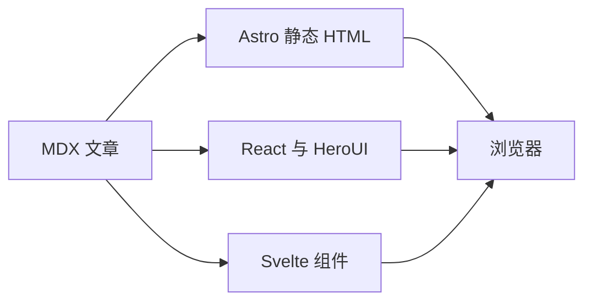

import AgentReplay from '../../components/demos/AgentReplay';
import HeroUIShowcase from '../../components/demos/HeroUIShowcase';
import SvelteCounter from '../../components/demos/SvelteCounter.svelte';
import Notice from '@tcitry/astro-book/components/Notice';
import packageJson from '../../../package.json';

Astro-book 延续 Hugo Book 的阅读风格，让文章、主题组件和前端实验在同一个页面中共存。这里的示例都可以直接操作。

[主题仓库](https://github.com/tcitry/astro-book) · [入门指南](https://github.com/tcitry/astro-book/blob/main/docs/getting-started.md) · [定制 API](https://github.com/tcitry/astro-book/blob/main/docs/architecture.md) · [编写 demo](https://github.com/tcitry/tcitry.github.io/blob/astro/docs/demo-authoring.md)

<div class="my-5 flex flex-wrap items-center gap-3 border-y border-[var(--gray-200)] py-3 text-sm">
  <label htmlFor="lab-reading-theme">试试不同外观</label>
  <select id="lab-reading-theme" data-book-theme-select aria-label="阅读主题" class="rounded-lg border border-[var(--gray-200)] bg-[var(--body-background)] px-3 py-2 text-[var(--body-font-color)]">
    <option value="auto">跟随系统</option>
    <option value="light">浅色</option>
    <option value="dark">深色</option>
  </select>
</div>

## HeroUI：编辑与即时预览

输入框、选择器、开关与卡片组成一个小型编辑器。切换到「样式与状态」，还可以比较按钮、状态标签和折叠面板。

<HeroUIShowcase client:visible />

## HeroUI Pro：完整的消息过程

默认展开一段完整回答，包含演示步骤、消息、来源和复制操作。点击「重新回放」，可以暂停、调速或直接跳到完整结果。

<AgentReplay client:visible />

同一个组件也可以[在独立页面打开](/lab/agent-replay/)。它只回放本地预设数据，不调用 AI 模型或后端服务。

## Svelte：独立状态，共同阅读

这个计数器使用 Svelte 的响应式状态与派生值。改变步长后，按钮和派生值会一起更新，React 演示的状态保持独立。

<SvelteCounter client:visible />

## Astro：静态主题组件

普通的 Astro 组件可以直接嵌入 MDX。例如下面的提示框来自 Astro-book，不需要加载 React 运行时：

<Notice variant="info">这段内容由主题的 Notice 组件输出，和文章一起生成静态 HTML。</Notice>

```mdx
import Notice from '@tcitry/astro-book/components/Notice';

<Notice variant="info">在文章中补充一条说明。</Notice>
```

## 文章的公式和图表

数学公式由 KaTeX 在构建时渲染，Mermaid 图表在页面需要时加载。下面仍然使用普通 Markdown 写法，代码块支持语法高亮与复制。

行内公式 $E = mc^2$ 和块级公式可以继续使用：

$$
\int_0^1 x^2\,dx = \frac{1}{3}
$$



## 组件写一次，使用两次

文章中按需加载同一份组件：

```mdx
import AgentReplay from '../../components/demos/AgentReplay';

<AgentReplay client:visible />
```

独立页面复用它，并在页面加载时启动交互：

```astro
---
import AgentReplay from '../../components/demos/AgentReplay';
---
<AgentReplay client:load />
```

本站的交互 MDX 页面放在 `src/pages/`，组件放在 `src/components/`。原有 Blog 内容继续通过只读兼容层导入；交互文章目前先在站点仓库中编写。

以后可以按实验需要继续加入 Vue、Three.js 或其他方案，复用这里的阅读布局和文档入口。

## 已有演示，统一构建

圆弧时间线已迁入本站的 Astro 页面，保留文章中原有的嵌入地址，也可以直接打开：

- [圆弧时间线](/demos/2026/rounded-timeline/)：Astro 静态卡片与 Tailwind v4，小脚本在尺寸变化时更新连接线。

它与博客共用开发、构建和部署命令，组件代码保存在本站。

## 使用与定制

本站由 Astro <code>{packageJson.dependencies.astro}</code> 静态生成页面，使用 `@tcitry/astro-book` 提供阅读布局；新增界面优先采用 Tailwind CSS <code>{packageJson.dependencies.tailwindcss}</code>，需要局部样式时再使用 CSS Modules。

交互区域使用 React <code>{packageJson.dependencies.react}</code>、HeroUI <code>{packageJson.dependencies['@heroui/react']}</code> 与 Svelte <code>{packageJson.dependencies.svelte}</code>。HeroUI Pro <code>{packageJson.dependencies['@heroui-pro/react']}</code> 是 `tcitry.github.io` 的增量接入；公开主题本身不依赖 React、HeroUI 或商业组件。

- [主题使用说明（英文）](https://github.com/tcitry/astro-book/blob/main/README.md)：能力范围、示例和安装方式。
- [入门指南](https://github.com/tcitry/astro-book/blob/main/docs/getting-started.md)：阅读布局、Markdown / MDX、导航与搜索。
- [公开 API 与定制入口](https://github.com/tcitry/astro-book/blob/main/docs/architecture.md)：参数、插槽与组件替换。
- [本站 demo 编写说明](https://github.com/tcitry/tcitry.github.io/blob/astro/docs/demo-authoring.md)：组件复用、局部样式、授权安装与验收。
