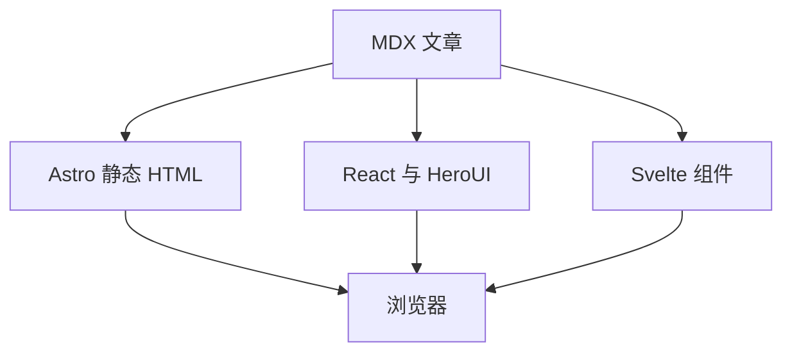

import AgentReplay from '../../components/demos/AgentReplay';
import HeroUIShowcase from '../../components/demos/HeroUIShowcase';
import HeroUIProShowcase from '../../components/demos/HeroUIProShowcase';
import SvelteCounter from '../../components/demos/SvelteCounter.svelte';
import Notice from '@tcitry/astro-book/components/Notice';
import packageJson from '../../../package.json';

export const demoDirectory = [
  {name: 'Lieflat Charts · 四种数据表达', description: '用 CellSlider 调整数量、时间趋势、100% 构成与前后对比，并查阅完整图型目录。', links: [{label: '数量比较', href: '/docs/Agents/lieflat-charts-best-practices/#tick-rows-example'}, {label: '三种新增示例', href: '/docs/Agents/lieflat-charts-best-practices/#more-chart-examples'}]},
  {name: 'Three.js · 3D 场景', description: '换形状、颜色与灯光，拖动查看物体，认识 3D 场景。', links: [{label: '打开页面', href: '/demos/2026/threejs-basics/'}]},
  {name: 'CSS · 圆弧时间线', description: '观察卡片之间的圆弧连接线怎样随页面宽度调整。', links: [{label: '打开页面', href: '/demos/2026/rounded-timeline/'}]},
  {name: 'HeroUI Pro · 选择与评价', description: '试用句子里的选择器和星级评分，查看即时反馈。', links: [{label: '本页体验', href: '#heroui-pro选择与评价'}]},
  {name: 'HeroUI Pro · 消息回放', description: '暂停、调速和重放一段包含步骤、来源与代码的回答。', links: [{label: '本页体验', href: '#heroui-pro完整的消息过程'}, {label: '独立页面', href: '/labs/agent-replay/'}]},
  {name: 'HeroUI · 编辑与预览', description: '编辑内容、切换样式，观察表单与预览如何同步。', links: [{label: '本页体验', href: '#heroui编辑与即时预览'}]},
  {name: 'Svelte · 响应式计数', description: '改变计数和步长，观察派生值一起更新。', links: [{label: '本页体验', href: '#其他框架svelte'}]},
  {name: 'Astro · 静态主题组件', description: '查看主题提示框如何和正文一起呈现。', links: [{label: '本页查看', href: '#astro静态主题组件'}]},
  {name: 'KaTeX 与 Mermaid', description: '查看文章里的数学公式、流程图及其 Markdown 写法。', links: [{label: '本页查看', href: '#文章的公式和图表'}]},
];

这里是本站 demo 的统一入口。从下面选择一个实验，直接打开独立页面，或跳到本页对应的交互示例。

[HeroUI Pro 组件文档](https://heroui.pro/docs/react/components) · [编写 demo](https://github.com/tcitry/tcitry.github.io/blob/main/docs/demo-authoring.md)


## Demo 列表

<div className="not-prose my-8 @container" data-demo-directory>
  <ul className="m-0! list-none p-0!">
    {demoDirectory.map((demo) => (
      <li key={demo.name} className="grid min-w-0 grid-cols-[minmax(0,1fr)_7rem] gap-x-4 gap-y-2 border-b border-[var(--gray-200)] py-4 first:border-t @min-[40rem]:grid-cols-[13rem_minmax(0,1fr)_7rem]">
        <span className="min-w-0 text-sm leading-6 font-semibold">{demo.name}</span>
        <p className="col-span-2 row-start-2 m-0 min-w-0 text-sm leading-6 @min-[40rem]:col-span-1 @min-[40rem]:col-start-2 @min-[40rem]:row-start-1">{demo.description}</p>
        <div className="col-start-2 row-start-1 flex flex-col items-end gap-2 text-sm leading-6 @min-[40rem]:col-start-3">
          {demo.links.map((link) => (
            <a key={link.href} href={link.href} aria-label={`${demo.name}：${link.label}`} className="text-[var(--color-link)] underline-offset-4 hover:underline focus-visible:outline-2 focus-visible:outline-offset-4">{link.label}<span aria-hidden="true"> →</span></a>
          ))}
        </div>
      </li>
    ))}
  </ul>
</div>

## HeroUI Pro：选择与评价

InlineSelect 把选择器放进一句话，Rating 用星级表达反馈。试试下拉选项、方向键和评分；变化会立即显示在下方。

<HeroUIProShowcase client:load />

## HeroUI Pro：完整的消息过程

默认展开一段完整回答，包含演示步骤、消息、来源和复制操作。点击「重新回放」，可以暂停、调速或直接跳到完整结果。

<AgentReplay client:visible />

这个示例只回放本地预设数据，不调用 AI 模型或后端服务。

## HeroUI：编辑与即时预览

输入框、选择器、开关与卡片组成一个小型编辑器。切换到「样式与状态」，还可以比较按钮、状态标签和折叠面板。

<HeroUIShowcase client:visible />

## 其他框架：Svelte

这个计数器使用 Svelte 的响应式状态与派生值。改变步长后，按钮和派生值会一起更新，React 演示的状态保持独立。

<SvelteCounter client:visible />

Labs 按组件库和框架组织实验；后续 Vue 或更多 Svelte 示例会沿用各自独立的组件与章节。目前的 Vue 示例尚未接入。

## Astro：静态主题组件

普通的 Astro 组件可以直接嵌入 MDX。例如下面的提示框来自 Astro-book，不需要加载 React 运行时：

<Notice variant="info">这段内容由主题的 Notice 组件输出，和文章一起生成静态 HTML。</Notice>

```mdx
import Notice from '@tcitry/astro-book/components/Notice';

<Notice variant="info">在文章中补充一条说明。</Notice>
```

## 文章的公式和图表

数学公式由 KaTeX 在构建时渲染，Mermaid 图表在页面需要时加载。下面仍然使用普通 Markdown 写法，代码块支持语法高亮与复制。

行内公式 $E = mc^2$ 和块级公式可以继续使用：

$$
\int_0^1 x^2\,dx = \frac{1}{3}
$$



## 组件写一次，使用两次

文章中按需加载同一份组件：

```mdx
import AgentReplay from '../../components/demos/AgentReplay';

<AgentReplay client:visible />
```

独立页面复用它，并在页面加载时启动交互：

```astro
---
import AgentReplay from '../../components/demos/AgentReplay';
---
<AgentReplay client:load />
```

本站的交互 MDX 页面放在 `src/pages/`，组件放在 `src/components/`。原有 Blog 内容继续通过只读兼容层导入；交互文章目前先在站点仓库中编写。

更多实验可以继续复用阅读布局、章节目录和组件入口。

## 已有演示，统一构建

Three.js 场景与圆弧时间线的独立页面已收录在顶部 Demo 列表。它们与博客共用开发、构建和部署流程，组件代码保存在本站；圆弧时间线继续保留文章中原有的嵌入地址。

## 使用与定制

本站由 Astro <code>{packageJson.dependencies.astro}</code> 静态生成页面，使用 `@tcitry/astro-book` 提供阅读布局；新增界面优先采用 Tailwind CSS <code>{packageJson.dependencies.tailwindcss}</code>，需要局部样式时再使用 CSS Modules。

交互区域使用 React <code>{packageJson.dependencies.react}</code>、HeroUI <code>{packageJson.dependencies['@heroui/react']}</code> 与 Svelte <code>{packageJson.dependencies.svelte}</code>。HeroUI Pro <code>{packageJson.dependencies['@heroui-pro/react']}</code> 由 tcitry-blog 接入；公开主题本身不依赖 React、HeroUI 或商业组件。本站文章与 MDX 的代码块继续使用 HeroUI Pro CodeBlock。

- [主题使用说明（英文）](https://github.com/tcitry/astro-book/blob/main/README.md)：能力范围、示例和安装方式。
- [入门指南](https://github.com/tcitry/astro-book/blob/main/docs/getting-started.md)：阅读布局、Markdown / MDX、导航与搜索。
- [公开 API 与定制入口](https://github.com/tcitry/astro-book/blob/main/docs/architecture.md)：参数、插槽与组件替换。
- [本站 demo 编写说明](https://github.com/tcitry/tcitry.github.io/blob/main/docs/demo-authoring.md)：组件复用、局部样式、授权安装与验收。
